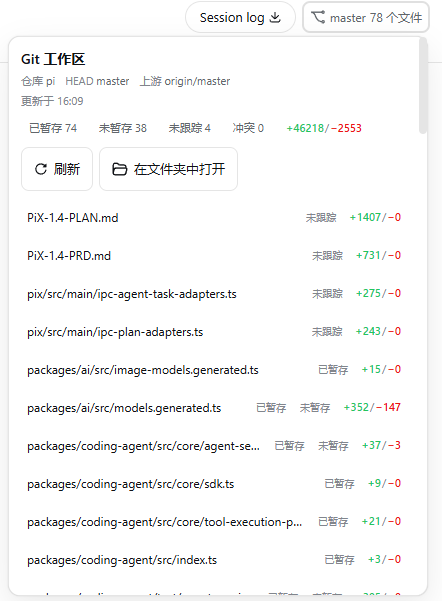

# dsh-git-dashboard

DeepSeek Harness（`dsh`）的仓外只读 Git 工作区看板。安装到 web profile 后，会话头部显示分支与变更摘要，可展开查看文件列表、分支比较，并对小改动做 unified diff 预览。



## 功能

- 会话头部入口：当前分支 / detached HEAD、变更文件数
- 看板：已暂存 / 未暂存 / 未跟踪 / 冲突计数，文件级 `+N/−M`（相对 HEAD；未跟踪按全新增计入）
- 同一文件可同时标记「已暂存」与「未暂存」
- 点击文件：相对 HEAD 的小 diff 预览（含未跟踪）；过大 / 二进制 / 冲突则说明原因
- 分支比较：选择基准分支，查看 ahead/behind 与文件摘要
- loopback 且 Host 允许时：「在文件夹中打开」

默认上限：单文件预览变更合计 ≤ 500 行，diff stdout ≤ 256 KiB（可配置）。

## 要求

- Node `^22.19 || >=24`（与 dsh 一致）
- 可用的 `dsh` 与本机 `git`
- web profile（默认 `~/.dsh/profiles/web`，或 `$DSH_HOME/profiles/web`）

## 安装

**不必 clone 本仓库。** 在 web profile 里 `pnpm add` 安装即可；发布包内已带 `lib/` 构建产物，profile 直接加载，无需本地编译。

clone 仅用于阅读源码、提 issue 或自行 fork 开发；与「给 dsh 装插件」无关。

在 web profile 目录安装本包（推荐 npm）：

```sh
cd ~/.dsh/profiles/web
pnpm add dsh-git-dashboard
```

也可从 GitHub 安装：`pnpm add github:Sombrer0-1/dsh-git-dashboard`（SSH：`git+ssh://git@github.com:Sombrer0-1/dsh-git-dashboard.git`）。固定版本可加 `@0.1.0` 或 `#v0.1.0`。

在 profile 的 `package.json` 中，把 `dsh-git-dashboard` 写入 `dsh.profile.bundles`，排在 `@deepseek-ai/dsh-base`（及已有 web bundle）之后：

```json
{
  "dsh": {
    "profile": {
      "bundles": [
        "@deepseek-ai/dsh-base",
        "@deepseek-ai/dsh-web-app",
        "dsh-git-dashboard"
      ]
    }
  }
}
```

安装后若 Host 报找不到 `@deepseek-ai/dsh-typert-protocol` 等包，在本包目录执行一次依赖链接（先成功跑过 `dsh web`，以便 profiles 的 `node_modules` 已就绪）：

```sh
cd ~/.dsh/profiles/web/node_modules/dsh-git-dashboard
node scripts/link-runtime-deps.mjs
```

`link-runtime-deps.mjs` 把 Host 侧 peer 链到 `$DSH_HOME/profiles/node_modules`：Windows 创建目录 junction（`mklink /J`），macOS / Linux 创建目录符号链接。仅当 Node 从插件真实路径解析依赖、走不到 profile 的 `node_modules` 时才需要（常见于 `pnpm add` 指向 git 仓库或 `link:` 路径）。

验证并重启：

```sh
dsh --profile web --dump-config
```

输出中应有 `# == dsh-git-dashboard`。然后重启 `dsh web`。

卸载：从 `dsh.profile.bundles` 去掉包名，再 `pnpm remove dsh-git-dashboard`。

## 配置

`cordis.patch.yml` 默认值（可在 profile 覆盖同名插件 `config`）：

| 字段 | 默认 | 含义 |
|---|---|---|
| `command` | `git` | Git 可执行文件 |
| `timeoutMs` | `2000` | 单次 git 命令超时 |
| `maxStatusBytes` | `1048576` | `git status` stdout 上限 |
| `maxNumstatBytes` | `524288` | numstat stdout 上限 |
| `maxFiles` | `100` | 列表最多文件数 |
| `maxBranches` | `100` | 分支列表上限 |
| `maxDiffBytes` | `262144` | 单文件 diff 预览字节上限 |
| `maxDiffChangedLines` | `500` | 单文件预览变更行（增+删）上限 |

## 安全说明

- Remote 使用 Gateway 现有 `trusted-host`，不另做 loopback-only。
- 会向已授权客户端暴露仓库名、分支名、路径与行数统计；小 diff 预览会传输该文件的 unified diff（受上限约束）。
- 建议在 loopback 使用；若 LAN trusted host 可连，请自行评估暴露面。

## 仓库内容

Git 仓库含源码与文档；`pnpm add` 装进 profile 的 npm 包按 `package.json#files` 发布，**不含** `src/`、`tests/`、`docs/`（运行时只读 `lib/`）。

| 路径 | 说明 |
|---|---|
| `lib/` | 构建产物；**安装后 profile 加载这里** |
| `cordis.patch.yml` | 插入插件行 |
| `scripts/link-runtime-deps.mjs` | 按需链接 Host peer（见安装节） |
| `src/` | 源码（仅 git 仓库；npm 包不含） |
| `tests/` | 单测（仅 git 仓库） |
| `docs/` | 截图与设计草案（仅 git 仓库） |

## License

MIT
